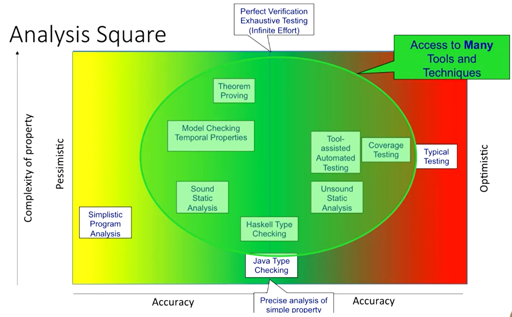

# Welcome to the course!

Hello!  And, welcome to Introduction to Software Testing, the first course in the Software Testing and Automation specialization, presented by the University of Minnesota Software Engineering Center (UMSEC).

## Who will guide our instruction? 

Throughout this course (and the courses that follow in this specialization), you'll meet three primary instructors, all with industry experience in addition to their work with UMSEC:

Sanjai Rayadurgam is the Director of the University of Minnesota Software Engineering Center (UMSEC) and is a Research Project Specialist in the  Department of Computer Science and Engineering. His research interests  are in software testing, formal analysis and requirements modeling, with  particular focus on safety-critical systems development. Prior to his  work at the University of Minnesota, he worked at Boston Scientific, performing advanced tools development, systems engineering, and verification and validation of implantable cardiac device. For his  doctoral dissertation he developed techniques to automatically derive  tests from behavioral models of software that could meet stringent  coverage criteria. He has co-authored several research papers and  articles in software engineering. He was a co-organizer of Dagstuhl seminar on Software and Systems Traceability for Safety-Critical  Projects in 2015, was a program co-chair for the NASA Formal Methods  Symposium in 2016 and is in the program committees of various workshops  and conferences in software engineering. You'll see him in the later courses for this specialization. 
[Read more about Sanjai Rayadurgam](https://www.umsec.umn.edu/directory/sanjai-rayadurgam)
.

Kevin Wendt is the Director of the Master of Science in Software Engineering program, run in coordination with the UMSEC. Kevin is a member of the teaching faculty in the Department of Computer Science & Engineering. In that capacity, he teaches undergraduate and graduate CSCI courses, serves as the department's Teaching Assistant (TA) Supervisor, and acts as the faculty liaison for the Senior Design Project course, interfacing with the external company sponsors and hiring the adjunct project managers for the course. Kevin's research focus is software engineering education. Current work is focused on evaluating online education and training for software engineering professionals. Prior to joining the U of M, he taught at Dunwoody College of Technology and worked as an Application Programmer for Wells Fargo & Co. He has coordinated the creation and launch of UMSEC's Coursera courses, including the Software Development LIfecycle specialization, in which he is also an instructor. You'll see him primarily in the first two courses. 
[Read more about Kevin Wendt](https://www.umsec.umn.edu/directory/Kevin-Wendt-0).

Dr. Michael Whalen is the Director Emeritus of UMSEC. He has over 20 years of experience in software development and analysis, including 10+ years experience in Model-Based Development & safety-critical systems. Dr. Whalen has developed simulation, translation, testing, and formal analysis tools for Model-Based Development languages including Simulink, Stateflow,  Lustre, and RSML-e. He has led successful formal verification projects on large industrial avionics models, including displays (Rockwell-Collins ADGS-2100 Window Manager), redundancy management and control allocation (AFRL CerTA FCS program) and autoland (AFRL CerTA CPD  program). Dr. Whalen was the lead developer of the Rockwell-Collins  Gryphon tool suite, which can be used for compilation, test-case generation, and formal analysis of Simulink/Stateflow models. This tool suite has been used both for academic research and industrial verification projects. You'll see him in the first several courses. [Read more about Dr. Michael Whalen](https://www.umsec.umn.edu/directory/Dr-Michael-Whalen-PhD). 

## How are we going to learn? 

- Week 1:  You will learn the basics of testing, the "what" of tests. What tests are and how to build them, with some hands-on tutorials on building your first set of executable tests.

- Week 2:  You will learn about the "why" of testing. What types of testing processes and techniques exist? How do we know what to use and when? And, how do we know our tests are any good?

- Week 3:  You will learn the process of testing. How do I organize the testing and document the results? How do I document and track defects that we (or our users) find in the software we build?

- Week 4:  Lastly, you will tackle the idea of Test Doubles, concepts that allow you to test your code without waiting. Instead of waiting for other code that your code relies upon to be built, we can "pretend" that the code is built, using some interesting software to mimic the behavior we rely on. This allows us to test our own code in isolation (proving our own code is right) without waiting for others (or future you) to build the other parts of the system. This will be a very hands-on module, putting into practice everything you've learned up to this point.

During the course, you will have lots of practice quizzes, graded quizzes, and programming assignments. I also encourage you to use discussion board to interact and learn from fellow learners. 

I hope you find this course useful and it helps you in your future endeavors.

Welcome aboard!